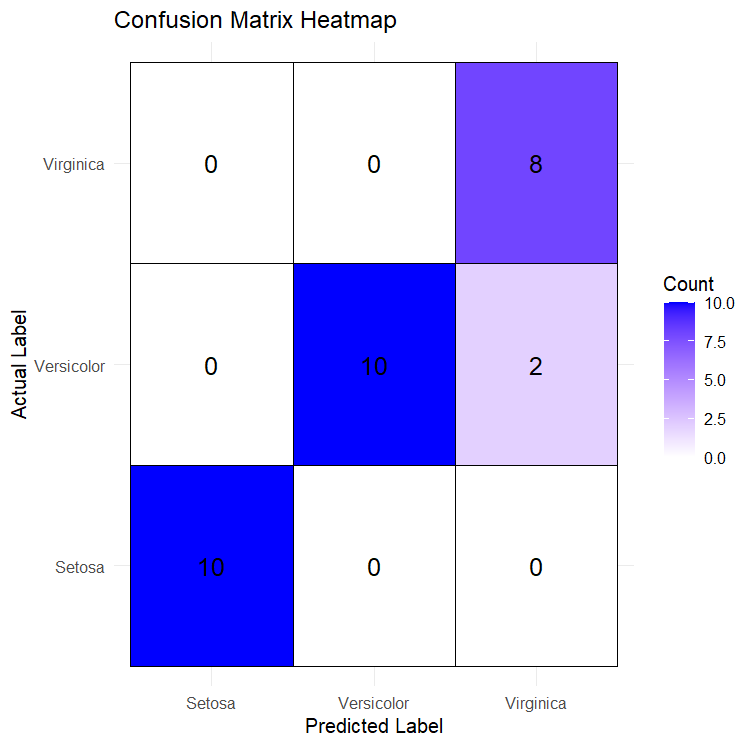

# Iris Classification with Random Forest & SVM 🌸🌿
This project trains and compares multiple machine learning models on the **Iris dataset** to classify flower species. Models used include **Random Forest**, **SVM**, **KNN**, and **XGBoost**, with a focus on improving performance through **feature engineering** and **hyperparameter tuning**.

## 📊 Model Performance Summary
✅ **Best Performing Model:** Support Vector Machine (SVM)  
✅ **Cross-Validation Accuracy (SVM):** 97.5%  
✅ **Test Accuracy:** 93.3% across models  
✅ **Consistent Misclassification:** 2 Virginica samples classified as Versicolor  

## 🛠️ Feature Engineering Implemented
- **PetalRatio:** `Petal.Length / Petal.Width`
- **PetalArea:** `Petal.Length * Petal.Width`
- **SepalPetalRatio:** `Sepal.Length / Petal.Length`
These additional features helped increase class separation and model expressiveness.

## 🤔 Why Not 100% Accuracy?
Despite improvements:
- Some Virginica samples had overlapping feature values with Versicolor.
- Even advanced models (like XGBoost) struggled due to small dataset size and limited feature separation.

## 🌟 Why SVM Stands Out
- SVM had the **highest cross-validation accuracy** and **Kappa score**.
- It showed more robust generalization across folds, despite similar confusion matrix results.

## 📌 How to Run
1. Clone this repository:  
   ```bash
   git clone https://github.com/abdulganiu99/Exploring-R-based-ML-Models
   ```
2. Open `iris_classification.R` in RStudio
3. ⚙️ Run the script step by step.
Make sure the required packages are installed the first time.
Some algorithms (e.g., XGBoost) require specific packages like xgboost,
even if called via caret.
4. Run all code blocks and inspect the confusion matrix, visual plots, and model comparison outputs

## 📷 Sample Plot



---
🔗 **Resources:**  
Dataset: Iris Dataset (Built-in in R)  
Models: Random Forest, SVM, KNN, XGBoost (via `caret`)  

✍️ Created by Abdul Ganiu


